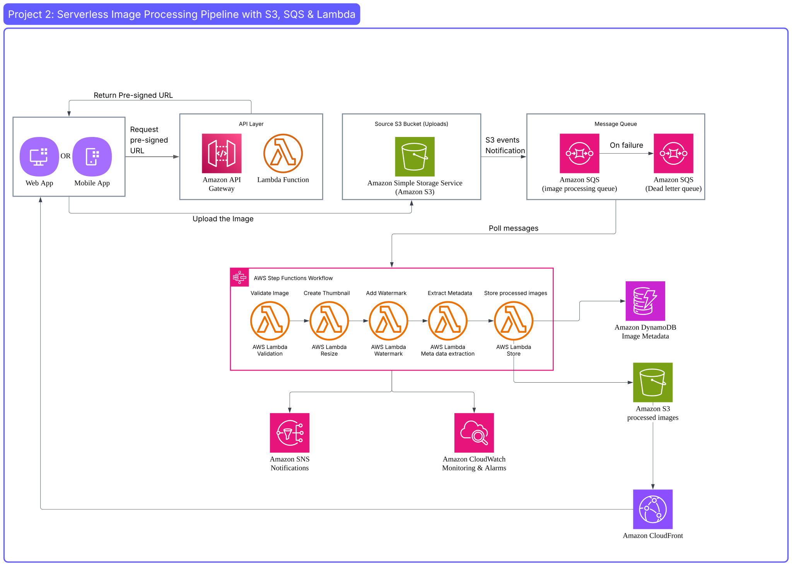

# Project 2: Serverless Image Processing Pipeline with S3, SQS & Lambda

> A fully serverless image processing pipeline built on AWS. Users upload images through a web or mobile application, which are then automatically validated, resized, watermarked, and delivered globally via CloudFront — with zero server management.

---

## Architecture Diagram

📐 [View Full Architecture on Lucidchart](https://lucid.app/lucidchart/b27b921e-350a-4278-a4f4-64a4a096ea43/edit?viewport_loc=-884%2C-724%2C4014%2C1875%2C0_0&invitationId=inv_00cecb84-ec96-4e1e-bb89-c1640d643fd8)

---

## Overview

This project implements an event-driven serverless image processing pipeline on AWS. No servers to manage, no idle costs, and automatic scaling based on demand.

**What it does:**
- Accepts image uploads from a web or mobile application
- Automatically processes each image (validate → resize → watermark → store)
- Stores metadata (dimensions, status, timestamps) in DynamoDB
- Delivers processed images globally via CloudFront
- Notifies on job completion or failure via SNS

---

## AWS Services Used

| Service | Role |
|---|---|
| **Amazon API Gateway** | Exposes the REST endpoint to request a Pre-signed URL |
| **AWS Lambda** | Generates Pre-signed URLs; executes each processing step |
| **Amazon S3 (Source)** | Stores original uploaded images; triggers SQS via event notifications |
| **Amazon S3 (Destination)** | Stores all processed image variants |
| **Amazon SQS** | Decouples S3 upload events from processing; buffers messages |
| **Amazon SQS (DLQ)** | Dead Letter Queue — captures failed messages after 3 retries |
| **AWS Step Functions** | Orchestrates the multi-step processing workflow |
| **Amazon DynamoDB** | Stores image metadata: key, name, dimensions, status, timestamps |
| **Amazon CloudFront** | Serves processed images globally from edge locations |
| **Amazon SNS** | Sends notifications on job completion or failure |
| **Amazon CloudWatch** | Collects metrics, logs, and triggers alarms |

---

## How It Works

**Step 1** — User opens the app and selects an image to upload.

**Step 2** — The app calls API Gateway → Lambda generates a **Pre-signed URL** (a temporary upload permission) and returns it to the app.

**Step 3** — The app uploads the image **directly to S3** using that URL.

**Step 4** — S3 fires an **Event Notification** to the SQS queue. SQS buffers the message, decoupling the upload from the processing.

**Step 5** — Step Functions polls SQS and runs the processing workflow (5 Lambda steps). Failed messages go to the **Dead Letter Queue (DLQ)**.

**Step 6** — Lambda (step 5.5) saves processed images to **S3 Destination** and metadata to **DynamoDB**. SNS sends a completion notification.

**Step 7** — **CloudFront** serves the processed images globally from the nearest edge location.

---

## Key Design Decisions

**Why Pre-signed URLs?**
Lambda has a 6MB payload limit. Pre-signed URLs allow users to upload large images (20–50MB) directly to S3 without any backend size constraint.

**Why SQS?**
SQS decouples the upload event from the processing logic. Under high load (e.g. 1,000 simultaneous uploads), SQS absorbs the traffic and Lambda processes messages at a controlled pace — no throttling, no message loss.

**Why Step Functions?**
Breaking the workflow into independent steps (validate → resize → watermark → store) makes each step retryable and debuggable individually, rather than having one large Lambda that fails entirely.

**Why CloudFront?**
S3 alone serves from a single region. CloudFront caches images at 400+ edge locations worldwide, reducing latency for global users.

---

